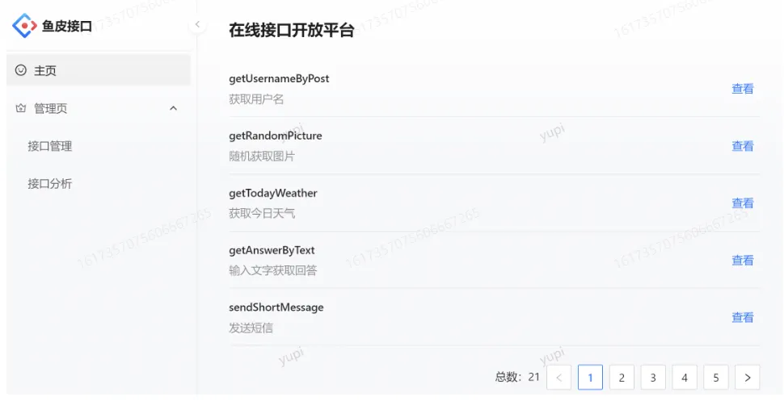
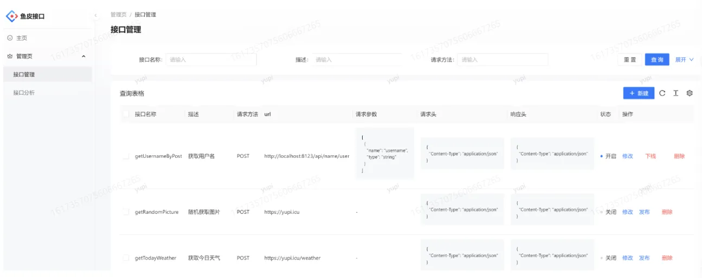
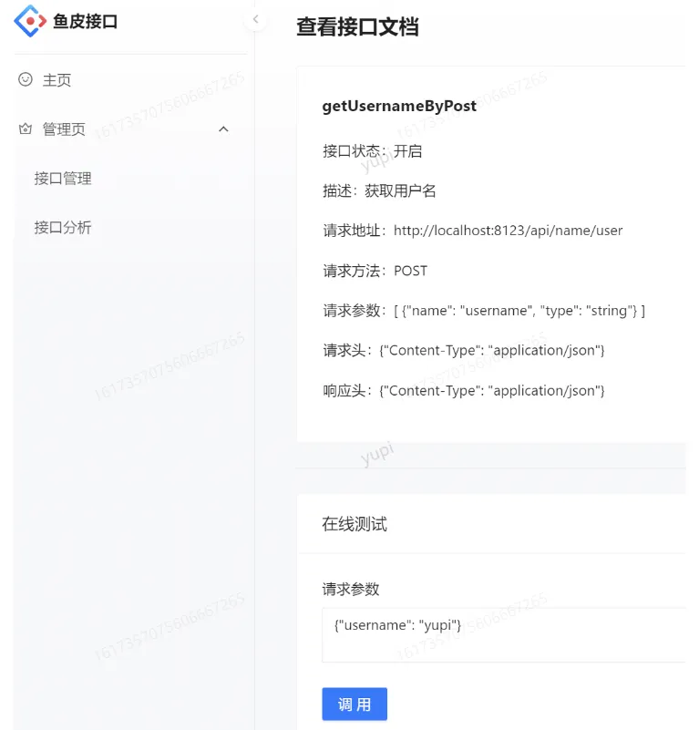

# open-api-platform
一个提供API接口调用的平台，用户可以登录注册，开通接口权限后，可以发布和调用接口，并且每次调用可以提供统计次数。管理员可以发布下线接口，接入接口，可视化接口的调用情况、数据。

# 一、技术栈

前端：React+ Ant Design Pro

后端：SpringBoot3 + SpringCloud-Gateway网关 + MySQL + MyBatis + MyBatis-plus + MyBatis X 自动生成 + Hutool + Swagger

# 二、功能大纲

1. 接口信息的CRUD、发布、下线
2. 接口用户关系表的CRUD，增减调用次数
3. SDK将API调用逻辑封装
4. 网关将调用链路调通

本项目是一个面向开发者的API平台，提供API接口供开发者调用。用户通过注册登录，可以开通接口调用权限，并可以浏览和调用接口。每次调用都会进行统计，用户可以根据统计数据进行分析和优化。管理员可以发布接口、下线接口、接入接口，并可视化接口的调用情况和数据。本项目侧重于后端，涉及多种编程技巧和架构设计层面的知识。

# 三、项目截图

主页（浏览接口）：

接口管理：

在线调试：

